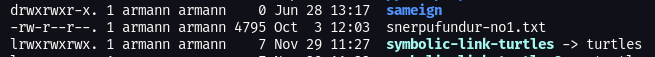
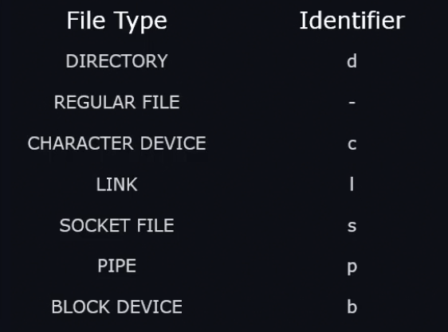
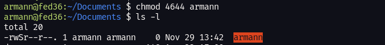
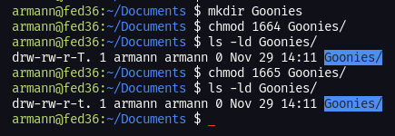
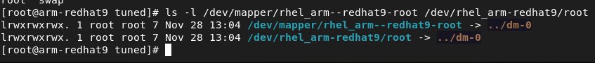
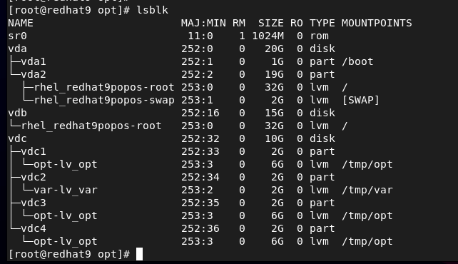
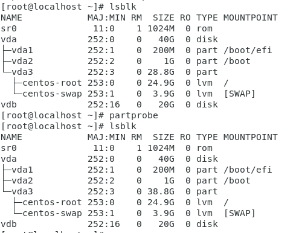

```shell
dr-xr-xr-x.   2 root root    6 Aug  9  2021 afs
lrwxrwxrwx.   1 root root    7 Aug  9  2021 bin -> usr/bin
dr-xr-xr-x.   5 root root 4096 Oct 17 11:37 boot
drwxr-xr-x.  19 root root 3240 Oct 17 11:37 dev
drwxr-xr-x.  88 root root 8192 Oct 18 12:02 etc
drwxr-xr-x.   4 root root   36 Oct 18 11:54 home
lrwxrwxrwx.   1 root root    7 Aug  9  2021 lib -> usr/lib
lrwxrwxrwx.   1 root root    9 Aug  9  2021 lib64 -> usr/lib64
drwxr-xr-x.   2 root root    6 Aug  9  2021 media
drwxr-xr-x.   2 root root    6 Aug  9  2021 mnt
drwxr-xr-x.   2 root root    6 Aug  9  2021 opt
dr-xr-xr-x. 271 root root    0 Oct 17 11:37 proc
dr-xr-x---.   3 root root  179 Oct 18 12:14 root
drwxr-xr-x.  32 root root  880 Oct 18 09:12 run
lrwxrwxrwx.   1 root root    8 Aug  9  2021 sbin -> usr/sbin
drwxr-xr-x.   2 root root    6 Aug  9  2021 srv
dr-xr-xr-x.  13 root root    0 Oct 17 11:37 sys
drwxrwxrwt.  12 root root 4096 Oct 18 12:12 tmp
drwxr-xr-x.  12 root root  144 Oct 17 11:23 usr
drwxr-xr-x.  20 root root 4096 Oct 17 11:36 var
```

With the exception of "/bin" (which is a symbolic link to /usr/bin) and "/afs" (Andrew File System), the top level directories are alphabetical in order of boot process importance.

| Mount Point | Function to boot process                                                                                                                      |
| ----------- | --------------------------------------------------------------------------------------------------------------------------------------------- |
| /afs        | Default directory for AFS (Andrew File System)                                                                                                |
| /boot       | Stores the kernel and related files. Initial ram file system, as well as GRUB (Boot Loader)                                                   |
| /dev        | Stores the device files (where the boot loader looks for the root filesystem)                                                                 |
| /etc        | Configuration directory for services, applications, processes, etc.                                                                           |
| /home       | Local user default storage location.  Every user has a subdirectory in /home.                                                                 |
| /media      | Default mounting location for optical or USB device.                                                                                          |
| /mnt        | Empty directory that can be used as a temporary mount point.                                                                                  |
| /opt        | Software related items like libraries and shared libraries.                                                                                   |
| /proc       | Preview into what the kernel is seeing. Processing power, memory utilization, etc (Files like meminfo that contain information about memory.) |
| /root       | root users home directory.                                                                                                                    |
| /usr        | Primary location for all the executables on the system.                                                                                       |
| /var        | Variable items in a sense of something that will change in size.  Mail spooler, print spooler, log files, etc.                                |
### Create and configure file systems

1. Create, mount, unmount, and use vfat, ext4, and xfs file systems

    * A file system is a logical container that is used to store files and directories. Each file system must be connected to the root of the directory hierarchy to be accessible. This is typically done automatically on system boot but can be done manually as well. Each file system can be mounted or unmounted using the UUID associated with it or by using a label that can be assigned to it. Mounting is the process of attaching an additional filesystem, which resides on a CDROM, Hard Disk Drive (HDD) or other storage device, to the currently accessible filesystem of a computer. 

    * Each file system is created in a separate partition or logical volume. A typical RHEL system has numerous file systems. During OS installation, the `/` and `/boot` file systems are created by default. Typical additional file systems created during installation include `/home`, `/opt`, `/tmp`, `/usr` and `/var`.

    * File systems supported in RHEL are categorised as disk-based, network-based, and memory-based. Disk-based and network-based file systems are stored persistently, while data in memory-based systems is lost at system reboot. The different file systems are shown below:

    | File System          | Type    | Description                                                                                                                                                                                                                                                                                                                                                                                                                                                                                                     |
    |----------------------|---------|-----------------------------------------------------------------------------------------------------------------------------------------------------------------------------------------------------------------------------------------------------------------------------------------------------------------------------------------------------------------------------------------------------------------------------------------------------------------------------------------------------------------|
    | ext2                 | Disk    | The second generation of the extended file system. The first generation is no longer supported. ext2 is deprecated in RHEL and will be removed in a future RHEL release.                                                                                                                                                                                                                                                                                                                                        |
    | ext3                 | Disk    | The third generation of the extended file system. It supports metadata journaling for faster recovery, superior reliability, file systems up to 16TB, files up to 2TB, and up to 32,000 sub-directories. ext3 writes each metadata update in its entirety to the journal after it has been completed. The system looks in the file system journal following a reboot after a system crash has occurred, and recovers the file system rapidly using the updated structural information stored in its journal. |
    | ext4                 | Disk    | The fourth generation of the extended file system. It supports file systems up to 1EB, files up to 16TB, an unlimited number of sub-directories, metadata and quota journaling, and extended user attributes.                                                                                                                                                                                                                                                                                                   |
    | xfs                  | Disk    | XFS is a highly scalable and high-performance 64-bit file system.  It supports metadata journaling for faster crash recovery, online defragmentation, expansion quota journaling, and extended user attributes. It supports file systems and files of sizes up to 8EB. It is the default file system in RHEL 8.                                                                                                                                                                                                  |
    | btrfs                | Disk    | B-tree file system that supports a system size of 50TB. It supports more files, larger files, and larger volumes than ext4 and supports snapshotting and compression capabilities.                                                                                                                                                                                                                                                                                                                              |
    | vfat                 | Disk    | This is used for post-Windows 95 file system format on hard disks, USB drives, and floppy disks.                                                                                                                                                                                                                                                                                                                                                                                                                |
    | iso9660              | Disk    | This is used for CD/DVD-based optical file systems.                                                                                                                                                                                                                                                                                                                                                                                                                                                             |
    | BIOS Boot            | Disk    | A very small partition required for booting a device with a GUID partition table (GPT) on a BIOS system.                                                                                                                                                                                                                                                                                                                                                                                                        |
    | EFI System Partition | Disk    | A small partition required for booting a device with a GUID partition table (GPT) on a UEFI system.                                                                                                                                                                                                                                                                                                                                                                                                             |
    | NFS                  | Network | A directory or file system shared over the network for access by other Linux systems.                                                                                                                                                                                                                                                                                                                                                                                                                           |
    | AutoFS               | Network | An NFS file system set to mount and unmount automatically on a remote system.                                                                                                                                                                                                                                                                                                                                                                                                                                   |
    | CIFS                 | Network | Common Internet File System (aka Samba). A directory or file system shared over the network for access by Windows and other Linux systems.                                                                                                                                                                                                                                                                                                                                                                    |

    * The *mount* command is used to attach a file system to a desired point in the directory hierarchy to make it accessible to users and applications. This point is referred to as the *mount point*, which is essentially an empty directory created solely for this point. The *mount* command requires the absolute pathname (or its UUID or label) to the block device containing the file system, and a mount point name to attach it to the directory tree. The *mount* command adds an entry to the `/proc/mounts` file and instructs the kernel to add the entry to the `/proc/mounts` file as well after a file system has been successfully mounted.

    * The opposite of the *mount* command is *unmount*, which is used to detach a file system from the directory hierarchy and make it inaccessible to users and applications.

    * To create a vfat file system:
        ```shell   
        mkfs.vfat <path>
        ```

    * To mount a vfat file system:
        ```shell   
        mount <path> /mnt
        ```

     * To unmount a vfat file system:
        ```shell   
        umount <path> /mnt
        ```

     * To check a vfat file system:
        ```shell   
        fsck.vfat <path>
        ```

    * To create an ext4 file system:
        ```shell   
        mkfs.ext4 <path>
        ```

    * To mount an ext4 file system:
        ```shell   
        mount <path> /mnt
        ```

     * To unmount an ext4 file system:
        ```shell   
        umount <path> /mnt
        ```

     * To check an ext4 file system:
        ```shell   
        fsck <path>
        ```

     * To get additional details about an ext4 file system:
        ```shell   
        dumpe2fs <path>
        ```

    * To create a xfs file system:
        ```shell   
        mkfs.xfs <path>
        ```

    * To mount a xfs file system:
        ```shell   
        mount <path> /mnt
        ```

     * To unmount a xfs file system:
        ```shell   
        umount <path> /mnt
        ```

     * To check a xfs file system:
        ```shell   
        xfs_repair <path>
        ```

     * To get additional details about an xfs file system:
        ```shell   
        xfs_info <path>
        ```

    * The path is the device name or a regular file that shall contain the file system.

1. Mount and unmount network file systems using NFS

     * To confirm nfs-utils is installed:
        ```shell   
        dnf install nfs-utils
        ```

     * To mount the network file system:
        ```shell   
        mount -t nfs 10.0.2.5:/home/nfs-share /mnt
        ```

     * Alternatively the following can be run after adding the entry to `/etc/fstab`:
        ```shell   
        mount -a 
        ```

     * Using AutoFS with NFS:
        ```shell
        # on the server
        systemctl status 
        mkdir /common
        echo "/common *(rw)" >> /etc/exports
        systemctl restart nfs-server.service

        # on the client
        dnf install autofs -y
        mkdir /autodir
        vi /etc/auto.master
        # add line
        #/- /etc/auto.master.d/auto.dir
        vi /etc/auto.master.d/auto.dir
        # add line
        #/autodir 172.25.1.4:/common
        systemctl restart autofs & systemctl enable autofs

        # on the server
        touch /common/test
        
        # on the client
        ls /autodir # confirm test file is created
        ``` 

1. Extend existing logical volumes

     * To extend the logical volume size by 2GB:
        ```shell   
        lvextend -L+2G /dev/vg1/lv1
        lvdisplay # confirm changes
        ```

     * To extend the file system:
        ```shell   
        df -Th # confirm file system type
        resize2fs /dev/vg1/lvl1 # for ext3 or ext4
        xfs_growfs /mnt # for xfs
        ```

1. Create and configure set-GID directories for collaboration

     * SUID (meaning set user id) is used to specify that a user can run an executable file with effective permissions of the file owner.  This is primarily used to elevate the privileges of the current user. When a user executes the file, the operating system will execute as the file owner. Instead of the normal *x* which represents execute permissions, an *s* will be visible. To set the SUID:
        ```shell
        chmod u+s <filename>
        ```
     
     * SGID (meaning set group id) is used to specify that a user can run an executable file with effective permissions of the owning group.  When a user executes the file, the operating system will execute as the owning group. Instead of the normal x which represents execute permissions, an s will be visible. To set the SGID:
        ```shell
        chmod g+s <filename>
        ```
    
     * To create a group and shared directory:
        ```shell
        groupadd accounts
        mkdir -p /home/shared/accounts
        chown nobody:accounts /home/shared/accounts
        chmod g+s /home/shared/accounts
        chmod 070 /home/shared/accounts
        ```

     * When using SGID on a directory all files that are created in the directory will be owned by the group of the directory as opposed to the group of the owner.

     * If the sticky bit is set on a directory, the files in that directory can only be removed by the owner. A typical use case is for the `/tmp` directory. It can be written to by any user, but other users cannot delete the files of others. To set the sticky bit:
        ```shell
        chmod +t <directory>
        ```

    * The SUID, SGID and sticky bit can also be set with number notation. The standard number (rwx) is prepended with 4 for SUID, 2 for SGID, and 1 for the sticky bit.

    * To remove special permissions the *-* flag is used instead of the *+* flag.
     
1. Configure disk compression

    * The Virtual Data Optimiser (VDO) provides data reduction in the form of deduplication, compression, and thin provisioning.

    * To install vdo:
        ```shell
        dnf install vdo kmod-kvdo
        ```

    * To create the vdo:
        ```shell
        vdo create --name=vdo1 --device=/dev/sdb --vdoLogicalSize=30G --writePolicy=async
        ```

    * To create and mount the file system:
        ```shell
        mkfs.xfs /dev/mapper/vdo1
        mount /dev/mapper/vdo1 /mnt
        ```

1. Manage layered storage

    * Stratis is a storage management solution introduced in RHEL 8 that allows the configuration of advanced storage features such as pool-based management, thin provisioning, file system snapshots and monitoring.

    * To install stratis:
        ```shell
        dnf install stratisd stratis-cli
        systemctl start stratisd
        ```

    * To confirm there is no file system on the disk to be used:
        ```shell
        lsblk
        blkid -p /dev/sdb
        ```

    * If there is a file system remove it using:
        ```shell
        wipefs -a /dev/sdb
        ```

    * To create a stratis pool and confirm:
        ```shell
        stratis pool create strat1 /dev/sdb
        stratis pool list
        ```

    * To create a file system and confirm:
        ```shell
        stratis fs create strat1 fs1
        stratis fs list
        ```

    * To mount the file system and confirm:
        ```shell
        mount /stratis/strat1/fs1 /mnt
        df -h
        # add to /etc/fstab to make it persistent
        ```

    * To add a disk to the stratis pool and confirm:
        ```shell
        stratis pool add-data strat1 /dev/sdc
        stratis pool list
        ```

    * To create a snapshot and confirm:
        ```shell
        stratis fs snapshot strat1 fs1 snapshot1
        stratis filesystem list strat1
        ```

    * To mount a snapshot:
        ```shell
        unmount /stratis/strat1/fs1
        mount /stratis/strat1/snapshot1 /mnt
        ```

    * To destroy a snapshot and confirm:
        ```shell
        unmount /stratis/strat1/snapshot1
        stratis filesystem destroy strat1 snapshot1
        stratis filesystem list
        ```

    * To remove a stratis filesystem and pool and confirm:
        ```shell
        stratis filesystem destroy strat1 fs1
        stratis filesystem list
        stratis pool destroy strat1
        stratis pool list
        ```

1. Diagnose and correct file permission problems

    * File permissions can be modified using *chmod* and *setfacl*.
# File Management

## File and Folder permissions.

When you do an ``ls -l``. The first identifier tells us what kind of file type it is.





Linux applies permissions in the following order.

1. Owner.
2. Group.
3. Others.

If you are the owner, Linux doesn't check the group or other permissions. So if you have read only permission and you are a part of the group that has read & write permission, you only have read permission. **The permissions are applied from left to right**.

## ACL

*ACL's are not a part of the RHCSA 9 but I still wrote down information about it.*

There are two types of ACL.    
-   The normal ACL. 
-   The default ACL. 

To create an ACL list you use the command ``setfacl``. 

``setfacl -R -m g:sales:rx filename``
``Setfacl -m d:g:profs:rx foldername/``

This sets the group profs as a default group that can read and execute all files creating in foldername in the future.

If fileacl not supported message appears, there is something wrong in the filesystem.

To see the acl.

``getfacl foldername``

## SUID, SGID, and Sticky Bit 

To apply SUID, SGID, and sticky bit, you can use chmod. SUID has numeric value 4, SGID has numeric value 2, and sticky bit has numeric value 1. 

**SUID = 4**

It executes as the user that ownes the file. Let's say that root owns a file and John executes that file, it's executed as root, not John. It's dangerous and not recommended practice.

*SUID on directories has no meaning*.  

``chmod u+s filename`` This enables set user id for that file. If Root is the owner. 
You can also set it by using the bits. ``chmod 4775 filename``

To see if the SUID bit is set the permissions is an **s** in the user section.
Looks like this: -rw**s**r--r--

If it's a lower case "s", then both the execute bit and the SUID bit are set. If it's and upper case, only the SUID bit is set.



To remove suid, ``chmod u-s filename`` or ``chmod 0664 filename`` where the 0 is the removes the special bit.

**SGID = 2**

It **inherits** DIR group owner when new files are created. It can good in shared environments.

This enables set group id for that folder.  
``chmod g+s foldername/``
You can also set it by using the bits. ``chmod 2775 foldername/``

To verify that group id is set for a folder, there is an s in the group sections.
drwxrw**s**r-x.

If it's a lower case "s", then both the execute bit and the GID bit are set. If it's and upper case, only the GID bit is set.

To remove GID, ``chmod g-s foldername/``

If the group has rwx on the directory, that means that any member of the that owns the directory **can delete files** within that folder. We might not want Melinda to be able to delete files that John creates. *That's where the sticky bit comes in*.

**STICKY = 1** 

*Sticky bit has no meaning on files but it does have meaning on directories*. 

The Sticky bit makes it so that delete only works if the **owner** deletes the file. Read about this problem under the SGID = 2 section. To check who is the owner of the current directory, ``ls -ld .`` You can also see it with the classic ``ls -la`` and it will be the first item listed. As you can see in the picture, the user armann and the group armann is the owner of the Goonies directory. You can also see that the Sticky bit is set for that directory.




This applies a sticky bit to all filed in the current directory.
``chmod +t *``
You can also set it by using the bits. ``chmod 1775 ``

To see if the Sticky Bit is set the permission has a **t** at the end. 
``-rw-r--r-t``
If it's a lower case "t", then both the execute bit for "others" and the Sticky bit are set. If it's and upper case T, only the Sticky bit is set, "others" does not have executable rights.

## Change ownership

``chown john:john alamo``
This changes the owner and the group on the file/folder alamo.
If you just want to change the group you can do ``chown :john alamo``
You can also use the ``chgrp`` command. ``chgrp john alamo``

## Change permissions

-   0 No permission.
-   1 Execute permission.
-   2 Write permission.
-   3 Write and execute permissions.
-   4 Read permission.
-   5 Read and execute permissions.
-   6 Read and write permissions.
-   7 Read, write, and execute permissions.

This gives the owner full permission, group read and execute permission, and others no permission on "myfile".

``chmod 750 myfile``

This is known as the absolute mode. There is a relative mode that you can use. Let's say I wanted to make myfile executable.

``chmod +x myfile``

## UMASK

Type in ``umask`` to see the default umask. Unless you have changed it, it should be "0022". The umask is used to assign default permission for new files and directories.

Default permission for directories is 777. Default permission for files is 666.

To calculate the permission bits for a new file or directory, we subtract the umask value from the default value.

-   666 - 022 = 644
-   777 - 022 = 755

The umask value can be found and configured in the following location.
-   /etc/profile System-wide default variables are stored.
-   /etc/bash.bashrc Default shell configuration files are stored

# LVM Management

## Add a new disk to LVM without using partitions

### Step 1
Let's start by scanning the scsi bus. This should discover any newly added disks without rebooting. 

``for D in $(ls /sys/class/scsi_host/) ; do echo "- - -" > /sys/class/scsi_host/$D/scan ; done``

Then run ``partprobe``

If that does not work you can do this.

``ls /sys/class/scsi_device/``
For everything listed do the following, **edit the numbers** to reflect what's listed on your server.
``echo 1 > /sys/class/scsi_device/0\:0\:0\:0/device/rescan``

Then run ``partprobe``

### Step 2
Let's add the disk to the physical volume group.
``pvcreate /dev/vdb``

Make sure to **change vdb** for the disk you want to add. A quick way to **find the name of your new disk** is the command ``lsblk``. Let's check to see that it was successfully added. You use the ``pvs`` command to get a short summary about the disks in your physical volume group. To get more information use ``pvdisplay``. The new disk should be listed.

### Step 3 ###
The next step is to add it to a current volume group, or create a new volume group if needed. If you don't know the name of your volume group, use ``vgs`` or ``vgdisplay`` to find it.

To **expand a current volume group**.
``vgextend rhel_redhat9 /dev/vdb`` 

rhel_redhat9 is the name of the volume group you want to expand. Remember **to change** both the name of the volume group and the disk to your specifications. Let's verify that the volume group was increased by the size of the disk that was added to the physical volume group. Use ``vgs`` or ``vgdisplay`` to see that the volume group now has some free space that we can add to a logical volume group.

### Step 4 ###
The last step is to add that free space to a logical volume group. If you don't know the name of your logical volume group, use ``lvs`` or ``lvdisplay`` to find it. Let's add all the free space to our logical volume group.

``lvextend -l +100%FREE /dev/rhel_redhat9/root``

Remember that "rhel_redhat9" is your volume group, and "root" is your logical volume group.
Nextwe need to extend the filesystem on the mounted volume group. To see the filesystem type being used issue ``df -Th``. I am running xfs, to use all of the available space.

``xfs_growfs /dev/mapper/rhel_redhat9-root``

If you are running ext4, you can grow the filesystem with ``resize2fs``.

Remember that it doesn't matter if you use the mapper path or not, both are symbolic links to the same thing.



## Expand a LVM partition

### Step 1 ###
Let's use this setup as an example.
We have the "vdc" disk that has four partitions.
Partition 1, 3 and 4 are all using the "opt" volume group, and "lv_opt" logical volume group.



### Step 2 ###
Let's add 2GB to the 10GB "vdc" disk, and then expand the "vdc4" partition using all that extra space.

**Let's use fdisk since the disklabel type is dos for the "vdc" disc. If the disklabel type is gpt, use gparted instead of fdisk.** You can see the disklabel type with ``fdisk -l``.

### Step 3 ###

``fdisk /dev/vdc``

Press "p" to print out the partition tables. Let's expand the last primary partition, "vdc4". Let's **check the free unpartitioned space** by pressing "F". If you are using an old version of fdisk, "F" will not be an option.

Here is the scary part, **we must delete the partition and recreate it** using the new size that we want. As you can see the vdc4 partition is 2G in size. Let's add 2GB to it and make it 4GB.

In fdisk, press "d" and select the partition you want to delete.

Let's re-create the partition by pressing "n." Press "enter" and select the default first sector.

For me it's going to be a primary parition number 4 and I select the default first sector that is proposed.

The disk was originally 2GB and I want to add 2GB to the disk, I will write +4GB when it prompts me in the next step. If you want to use all of the space, just press "enter".
Last sector, +/-sectors or +/-size{K,M,G,T,P} (12584960-52428799, default 52428799): **+4G**

It asked me. "Do you want to remove the signature? [Y]es/[N]o:" I pressed N. **Since we are resizing a partition we must certainly want to keep it.**

Press "w" to write the information to disk. Now vdc4 has 4GB instead of 2GB.

### Step 4 ###

Let's add it to LVM.  ``pvresize /dev/vdc4`` Let's verify the free space ``pvs``

If you run ``vgs`` you can see that the "ops" volume group now has free space since the vdc4 partition was allocated to the "ops" volume group.

### Step 5 ###

Now we extend the logical volume group "lv_opt". 
``lvextend -l +100%FREE /dev/opt/lv_opt``

### Step 6 ###

Grow the filesystem.
``xfs_growfs /dev/mapper/opt-lv_opt``

## Create a volume group and a logical volume group ###

### Step 1 ###

Add the disk or partition to the physical volume group. Change vdc1 for your disk/partition.
``pvcreate /dev/vdc1`` 

### Step 2 ###

Let's create the volume group named "var" using /dev/vdc1.
``vgcreate var /dev/vdc1``

### Step 3 ###

Let's create the logical volume group named "lvdata" and use all of the space available from the "var" volume group we just created. 
``lvcreate -l 100%FREE -n lvdata var``

### Step 4 ###

Now we need to add a filesystem to our logical volume.
``mkfs.xfs /dev/var/lv_var``

### Step 5 ###

Mount the filesystem. Change /tmp/var for whatever you are using.
``mount /dev/var/lv_var /tmp/var/``
Mount it using /etc/fstab if you want the mount to survive a reboot. In /etc/fstab, this would mount the lv_var in the /tmp/var directory.

``/dev/opt/lv_var	/tmp/var				xfs	defaults	0 0``

## GPT Disks

### Step 1

If you need to verify that you are using gpt, ``fdisk -l`` 
You should see, "Disk label type: gpt"
If you see Dos, use another method then this one.

Increase disk size in virtual host.

Let's start by scanning the scsi bus. This should discover any increased disk size without rebooting. 

``for D in $(ls /sys/class/scsi_host/) ; do echo "- - -" > /sys/class/scsi_host/$D/scan ; done``

Then run ``partprobe``

If that does not work you can do this.

``ls /sys/class/scsi_device/``
For everything listed do the following, **edit the numbers** to reflect what's listed on your server.
``echo 1 > /sys/class/scsi_device/0\:0\:0\:0/device/rescan``

Then run ``partprobe``

### Step 2

``gdisk -l /dev/vda`` 
Change out vda for your disk.

"Total free space is ..." should list the free space.

### Step 3 

``gdisk /dev/vda``

Press "p" to print out your partition table. Take note of Start (sector) and the End (sector) for the partition you want to expand.

Next, press "i", this will print out your "Partition unique GUID".
You need to use it later so print it out now.

Next we need to delete the partition. Press "d" and select the partition you want to expand.

Then press "n" and create a new partition.

Check to see if the "First sector" matches the "First sector" you saw when you printed out the partition tables. It should by default be fine, press Enter.

The "Last sector" should be different, a higher number than before. Compare it to the "Last Sector" when you printed out the partition tables. If you want to use all of the free space available just press enter. If you want to increase it by a specific amount type in +2GB or whatever you need.

Then it asks you about the filesystem type. Something like this:

Current type is 'Linux filesystem'
Hex code or GUID (L to show codes, Enter = 8300):

We need to set it to LVM so press "L".
Type in 8e00, you might need to do it twice.

Press "p" and verify that the partition size has increased.

Now press "x" to enter the "expert mode".

Press "c" to set the GUID to the old value.
Copy and paste in the old GUID.

Next press "w", it will say, "Final checks complete. About to write GPT data. THIS WILL OVERWRITE EXISTING PARTITIONS!!"

Press "Y".

### Step 4

Run ``partprobe`` 
Run ``lsblk`` and you should see the increased size. 
/dev/vda3 was increased by 10GiB.



### Step 5

Last step is to increase the size in LVM.

``pvresize /dev/vda3``
``pvs`` To see the "PFree". In my case it was 10GiB.

``lvresize -r -l +100%FREE /dev/centos/root``
Make sure to use the your vg and lv names.

``df -Th`` Verify that you lvm has increased by the size you wanted.

## Create a VG with a different physical extent

The default physical extent size is 4MB. If you want a larger physical extent
you must do so when you create the VG. Let's say you want a VG names data and
the physical extent size should be 8MB.

``vgcreate -s 8M data /dev/nvem0n1p2``

### Debug

1. If you get this error.
Warning: **Not all of the space available to /dev/sda appears to be used**, you can
fix the GPT to use all of the space (an extra 10485760 blocks) or continue with
the current setting? Fix/Ignore?
   2. This is fixed with ``parted -l``
2. If you have a machine that has been cloned. You might get this message when you run ``pvs`` **Device files last seen on "device" not found.**
   4. ``rm /etc/lvm/devices/system.devices``
   5. ``vgimportdevices -a``
6. 

# NFS and Autofs (Automount)

## NFS

NFS is not a part of the RHCSA exam. It's just something we need to set up to work on autofs. I had two machines, the nfsserver and the client machine. On the nfsserver, do the following.

Install NFS server.
``dnf install nfs-utils``

Create the directory that you want to export. 
``mkdir /nfsdata``

Put it into the exports file. ``vim /etc/exports`` \
This is just an example, it's insecure, don't use it. ``/nfsdata *(rw,no_root_squash)``

Enable and start the NFS server in one command.
``systemctl enable --now nfs-server``

To quickly open up the firewall to allow NFS. It adds the nfs, mountd and rpc-bind services to the firewall services.

``for i in nfs mountd rpc-bind; do firewall-cmd --add-service $i --permanent; done``

``firewall-cmd --reload``

``firewall-cmd --list-all``

## Autofs

On the exam, check **"/etc/auto.misc"** for nice syntax examples that can help if you're stuck!
You won't see auto.misc until you have installed the autofs package.

Now on the client that will be using autofs, do the following.

First make sure you can see the exports on from the NFS Server.

``showmount -e nfsservername``

Automount is common for home directories. An NFS server is providing access to home directories, and the home directory is automounted when the user logs in.

Install autofs.

``dnf install autofs``

In "/etc/auto.master" you'll identify the directory that automount should manage, and the file that is used for additional mount information.

- "/nfsdata" and "/etc/auto.nfsdata"
- "/nfsdata" is the mounting point and the second line "/etc/auto.nfsdata" is a file you create that gives the necessary parameters to mount it.
- In "/etc/auto.nfsdata" you'll identify the subdirectory on which to mount, and what to mount.
- files -rw nfsservername:/nfsdata

Files is a subdirectory under /nfsdata that is created when you cd into it.

For nfsserver, put the ip or the DNS name of the server you want to automount from.

Enable and start the autofs service.
``systemctl enable --now autofs``

This will automatically create the folders necessary under the root "/" folder. In this example it creates the ''/misc" and "/nfsdata" folders. If you cd /nfsdata, it should be empty. If you ``cd`` into files, even though /nfsdata is empty you will cd into the /nfsdata directory on the nfsserver.

### Home directories

To support different directory names in one automount line, wildcards are used.

Put the following line in "/etc/auto.master".
/home/ldap    /etc/auto.ldap
This auto mounts all subdirectories under /ldap.

Let's create the file "/etc/auto.ldap".

``vim /etc/auto.ldap``

Insert the line.
``*    -rw  localhost:/home/ldap/&``

Let's say you have multiple home directories under "/home/ldap/1", "/home/ldap/2", etc. The ampersand at the end replaces whatever comes after /ldap/.

When that is done.
``systemctl restart autofs``
